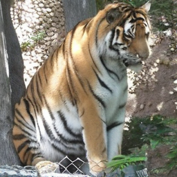
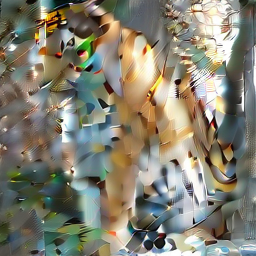
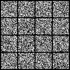

# EFAE: Equivariant Flow-based Autoencoder (for better Latent diffusion models lol)

The goal here to make a great autoencoder. Whats the modern problem of the autoencoder, such as SDXL-vae? The problem is that we cannot flip the latents, and expect the outcome to be flipped. Here is what I mean:

Ok, this is a great chubo tiger. Now let's flip the latent, and decode it back:

Oh no! what is going on?

Since this was not what you were asking for on the training objective, we cannot expect for this to be flipped. In general, we cannot expect any such properties as such to hold. Formally, consider the group action (such as flipping) $g \in G$ on both Image space $I$ and same canonical actions on latent space $Z$. We want the autoencoder to be equivariant, that is, for any $z \in Z$ and $g \in G$, we want $f(gz) = g f(z)$, where $f$ is the autoencoder.

$$
\begin{array}{ccc}
I & \xrightarrow{f} & Z \\
\downarrow_{g} & & \downarrow_{g} \\
I & \xrightarrow{f} & Z
\end{array}
$$

Ok this is clearly a nice property to have. But how do we achieve this?

## Equivariant Flow-based Autoencoder

The idea is to use a flow-based model. The flow-based model is a generative model that models the data distribution by transforming a simple distribution (such as Gaussian) to the data distribution. By utilizing the conditional flow-matching objective, one can train a deocder $p(x | z)$ that maps the latent space to the data space.

Then the next idea here is to train the encoder that maps $I \rightarrow Z$ to be equivariant, in end-to-end fashion. This can be done with following objective

$$
\begin{equation}
L = \mathbb{E}_{x \sim p(x)} [ \mathbb{E}_{z \sim q_\phi(z | x)} [ -\log p_\theta(x | z) ] ]
\end{equation}
$$

Here, we can use the flow-based model for $p_\theta(x | z)$, and train the encoder $q_\phi(z | x)$ to be equivariant, via augmenting the objective that expects the equivariance. We randomly sample group action $g \in G$, perform one on the latent space $z$, and expect the outcome to be the same as the group action on the data space $x$. This can be done by augmenting the objective as follows:

$$
\begin{equation}
L = \mathbb{E}_{x \sim p(x), g \sim p(G)} [ \mathbb{E}_{z \sim q_\phi(z | x)} [ -\log p_\theta(gx | gz) ] ]
\end{equation}
$$

The rest follows the standard flow-based model training. Here we use the code based on [minRF](https://github.com/cloneofsimo/minRF).

## What should be the group actions on the latent space?

1. Vertical, Horizontal flip: For the image data, we can flip the image vertically or horizontally. In the latent space, naive flipping won't make it due to the nature of the locality-favoring property of the common VAE. Consider the following example:

$$
I = \begin{bmatrix}
0 & 1 & 0 & 1 \\
1 & 0 & 1 & 0 \\
1 & 0 & 1 & 0 \\
0 & 1 & 0 & 1
\end{bmatrix}
$$

Now suppose the latent space to be 2x2 adaptive-average-pooled version of the image. For example, the latent space can be:

$$
Z = \begin{bmatrix}
0.5 & 0.5 \\
0.7 & 0.7 
\end{bmatrix}
$$

Great, now let's flip the image horizontally. The image becomes:

$$
I = \begin{bmatrix}
1 & 0 & 1 & 0 \\
0 & 1 & 0 & 1 \\
0 & 1 & 0 & 1 \\
1 & 0 & 1 & 0
\end{bmatrix}
$$

Which corresponds to the latent space:

$$
Z = \begin{bmatrix}
0.7 & 0.7 \\
0.5 & 0.5
\end{bmatrix}
$$

Oh no! For the naive flipping, the latent space is not flipped. Although this example was constructed to show the problem, in general, the latent space is not flipped indeed does not need to represent the flipped image. By looking at the local-structure of the matrix, we are motivated to further impose the locally chiralitical features. For this, we can consider the complex-valued latent space, and impose the following property:

$$
g_\text{flip} Z = Z^*, g_\text{flip}^2 Z = Z
$$

This way, the latent space can be flipped, and the equivariance can be achieved. In practice, you can flip the later part of latent feature to introduce local chirality. Following is the example of the latent space that satisfies the above property:

Above 8 is the decoded image from the latent space, and last 8 is the flipped version of the latent space. The latent space is flipped, and the decoded image is flipped as well.

## 2. Rotation

For the image data, we can rotate the image by 90, 180, 270 degrees. Same goes for latent space, but also have auxiliary feature axis that encodes the rotation angle. Motivated by [RoPE](https://arxiv.org/abs/2104.09864),

$$
Z = \begin{bmatrix}
Z_1 \\
Z_2
\end{bmatrix}
$$

$$
g_\Theta Z = \begin{bmatrix}
Z_1 \\
R_\Theta Z_2
\end{bmatrix}
$$

Where $R_\Theta$ is the rotation matrix. This way, the latent space can be rotated, and the equivariance can be achieved. Note that the rotation matrix can be learned as well in general (as long as they satisfy the group action property).

